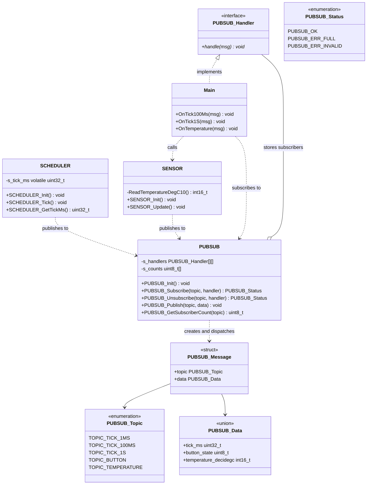

# ESE-301 Homework 5: Publish-Subscribe Pattern UML

```mermaid
classDiagram
    class PUBSUB_Handler {
        <<interface>>
        +handle(msg)* void
    }

    class PUBSUB {
        -s_handlers PUBSUB_Handler[][]
        -s_counts uint8_t[]
        +PUBSUB_Init() void
        +PUBSUB_Subscribe(topic, handler) PUBSUB_Status
        +PUBSUB_Unsubscribe(topic, handler) PUBSUB_Status
        +PUBSUB_Publish(topic, data) void
        +PUBSUB_GetSubscriberCount(topic) uint8_t
    }

    class PUBSUB_Message {
        <<struct>>
        +topic PUBSUB_Topic
        +data PUBSUB_Data
    }

    class PUBSUB_Data {
        <<union>>
        +tick_ms uint32_t
        +button_state uint8_t
        +temperature_decidegc int16_t
    }

    class PUBSUB_Topic {
        <<enumeration>>
        TOPIC_TICK_1MS
        TOPIC_TICK_100MS
        TOPIC_TICK_1S
        TOPIC_BUTTON
        TOPIC_TEMPERATURE
    }

    class PUBSUB_Status {
        <<enumeration>>
        PUBSUB_OK
        PUBSUB_ERR_FULL
        PUBSUB_ERR_INVALID
    }

    class SCHEDULER {
        -s_tick_ms volatile uint32_t
        +SCHEDULER_Init() void
        +SCHEDULER_Tick() void
        +SCHEDULER_GetTickMs() uint32_t
    }

    class SENSOR {
        -ReadTemperatureDegC10() int16_t
        +SENSOR_Init() void
        +SENSOR_Update() void
    }

    class Main {
        +OnTick100Ms(msg) void
        +OnTick1S(msg) void
        +OnTemperature(msg) void
    }

    PUBSUB o-- PUBSUB_Handler : stores subscribers
    PUBSUB_Handler <|.. Main : implements
    PUBSUB ..> PUBSUB_Message : creates and dispatches
    PUBSUB_Message --> PUBSUB_Topic
    PUBSUB_Message --> PUBSUB_Data
    SCHEDULER ..> PUBSUB : publishes to
    SENSOR ..> PUBSUB : publishes to
    Main ..> PUBSUB : subscribes to
    Main ..> SENSOR : calls
```
